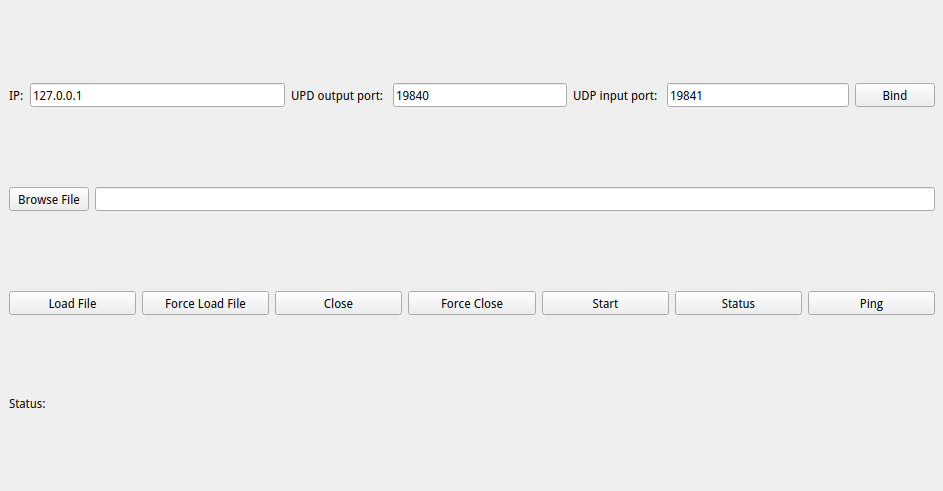

# LightBurn UDP Controller

A specialized UDP communication interface designed for controlling and monitoring LightBurn laser cutting/engraving software. Enables remote operation, job monitoring, and automation integration.

 <!-- Add your screenshot path here -->
